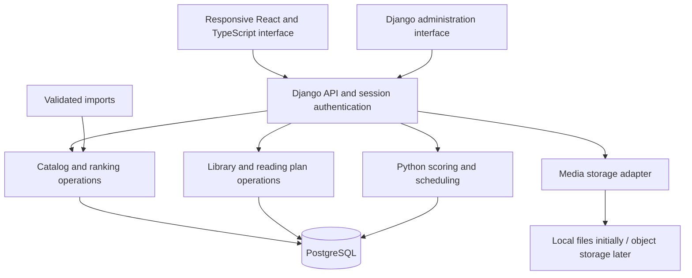

# Humanities rankings app — product plan

Status: first local application implemented, with database-backed empty ranking definitions, an imported initial research survey and the Python reading-time prototype. Updated 12 September 2026. [README.md](README.md) describes launch commands, current features and implementation limits; sections below retain the complete intended product scope.

The owner authorized starting general ranking research, then asked to prioritize a runnable first application and continue research afterward. The Django/React application now has a database schema, migrations, 65 empty ranking/collection definitions, local first-account setup and persistent source imports. The existing 51-source survey belongs only to `books-all-time`; every other target starts with zero evidence. No catalog works, people, ranked entries, images or criterion scores are seeded. Criteria and weights will be designed separately. The repository was empty when planning began.

Confirmed direction: a Python backend; Docker is familiar; a responsive website for computer and phone; rankings calculated from user-selected criteria and weights; the full requested feature set in the first complete release. The owner tentatively identified the classics collection as Great Books of the Western World. Its edition remains to be chosen.

Assessment workflow confirmed: agents research and propose criterion scores with explanations; the owner can review and override them. Changing a personal override must not alter the shared assessment for other users.

Further confirmed choices: React/TypeScript frontend; reading in English for now; scheduling by flexible weekly/monthly page targets (optional per reading day), with effort-adjusted capacity, manual adjustments and locked books; private profiles, reading plans, and weights with optional sharing of selected lists.

Coverage is worldwide, with verified English editions/translations for reading recommendations. All-time books include all subjects; literary fiction, nonfiction, philosophy, and other literary forms also have dedicated rankings. Country association follows documented literary/cultural ties and may be multiple. Plan for a wider public audience after the local version. Benjamin McEvoy's reading list and monthly lecture readings are included. Every ranking must show when it was updated and when its research was last refreshed.

**Mandatory research requirement: a hard minimum of 50 distinct, relevant sources for every requested research target, ideally many, many more than 50. Fifty is the floor, not the intended research depth or a stopping rule. Sources must be diverse: academic research and criticism, independent rankings, websites, blogs, reviews, and reader discussions including Reddit and Goodreads. Many sources from just one community do not satisfy the requirement.** The owner will define criteria when each ranking is designed. This minimum applies to each requested author, era/decade, topic, style, custom tag, or other research target, with explicit scope and an auditable evidence ledger. See [the research skill](docs/skills/humanities-ranking-research/SKILL.md) for counting and synthesis rules.

## 1. Product intent

Reader/editor boundary clarified on 12 September 2026: agents extract and synthesize the main rankings from relevant online research and save them in the database. The normal Rankings pages are read-only. Bookmarking can enable private personalization; changing membership or manual order creates/edits a personal copy. Shared originals are maintained through a separate editorial workflow. The owner will perform browser checks and has asked to stop automated testing for this iteration.

Reading collections sits directly below Published rankings in navigation. The sidebar must scroll in short windows. Planner settings start collapsed into a compact summary so month cards are visible immediately; expanded controls have equal heights.

Discovery has three separate sections: Researched rankings (agent synthesis), Published rankings (faithful extraction of an existing ranking, such as the Guardian), and Reading collections (unranked lists and reading programmes, such as McEvoy and Great Books). A reading sequence has study order, not merit rank. The same collection can be evidence for a separately researched ranking without merging their identities or source counts.

Build a humanities library for discovering books and thinkers, exploring rankings, saving useful collections, and planning reading. Start with philosophy and literature and one local user; design for public discovery and separate private user accounts when hosted.

Requested capabilities:

- Overall philosophy rankings of works and philosophers, with separate rankings for each type of entry.
- Rankings of an individual philosopher's works.
- Philosophy rankings by topic, such as epistemology, ethics, metaphysics, and political philosophy.
- Equivalent literature rankings, including overall, author, genre, and era views.
- Bookmarked external rankings and unranked reading collections.
- Book covers and author portraits, with support for storing image files.
- Personal lists, a profile, reading status, and a monthly reading schedule.
- A polished interface with light and dark themes.
- Durable instructions so future agents can extend the app and curate rankings consistently.
- Estimated reading hours for each book, sensitive to difficulty and the chosen edition, with an upgradeable Python algorithm.
- Country and century rankings, translation recommendations, and an eventual one-or-three-books-from-every-country collection.
- Visible ranking update dates, research age, refresh preferences, and reviewable research revisions.

The first complete release also includes weight controls, automatic recommendations from assessed catalog data, reading progress, and scheduling. Implementation can proceed in stages, but these features are not being removed from the requested release. Research has started independently of implementation; final ranking population awaits criteria and evidence-backed assessment.

Ranking contents must remain empty during the initial template work. Category names, source metadata, and empty list definitions are acceptable; invented ranks, scores, biographies, and reading histories are not.

## 2. Suggested format and stack

Start with a responsive web application that works on a computer and phone. Consider installation as a progressive web app later if desired. Offline editing and synchronization are separate features that need an explicit requirement; a local server does not automatically make the app available on an offline phone.

Use one repository with a Django backend and a React/TypeScript frontend. Vite is the proposed frontend build tool. Organize the backend into catalog, rankings, sources, library, planner, and media modules within one application deployment.

| Part | Provisional choice | Reason and tradeoff |
| --- | --- | --- |
| Backend language | Python | Matches the owner's experience and hosts business rules, scoring, scheduling, and imports. |
| Backend framework | Django | Provides the ORM, migrations, authentication, forms, and an internal administration interface in one framework. |
| API | Django REST Framework | Keeps validation and permissions beside Python business logic. An API schema can generate frontend types. |
| Frontend | React + TypeScript, with Vite proposed for builds | The owner selected this for live ranking controls, rich list editing, and scheduling, accepting the additional language/toolchain. |
| Styling | Custom CSS theme variables and React components in this version | Creates the requested modern academic light/dark appearance without an additional UI framework dependency. |
| Database | PostgreSQL for Compose/hosting; SQLite for the direct local launch | PostgreSQL suits shared public use. SQLite makes this workspace launchable while Docker is unavailable; moving existing data later requires a deliberate migration. |
| Database access | Django ORM and committed migrations | Uses the framework's own database tools. Enforce relationships and constraints in PostgreSQL. |
| Input validation | Django forms / DRF serializers | The server validates requests and future import files. Frontend validation is for usability, not authority. |
| Authentication | Django users and session authentication from the beginning | Create one local account initially. Later users use the same identity and ownership model. |
| Media | Django storage interface; persistent local directory initially, object storage when hosted | Store keys and image metadata in PostgreSQL, with image bytes in file storage. |
| Scoring and recommendations | A Python domain module with versioned criteria, assessments, weights, and scoring rules | Produces explainable scores and can be tested independently of the website. |
| Reading planner | Python scheduling rules plus the frontend planner | Uses weekly/monthly or per-reading-day targets, flexible reading days, provisional effort/density adjustments and locked books. Planning suggestions do not silently alter saved plans. |
| Reading-time estimates | Independently versioned Python domain function | Uses length, difficulty and reader pace; returns approximate hours, assumptions, and unavailable status for missing length. A tested placeholder exists. |
| Search | PostgreSQL queries and indexes | Start with titles, alternate titles, people, and categories. Add full-text search when descriptions justify it. |
| Verification | Django TestCase/standard-library unittest, TypeScript build checks, Playwright for critical journeys | Concentrate on scoring, scheduling, ranking integrity, personal data ownership, imports, and the reading workflow. |
| Deployment | One Python web service/container, managed PostgreSQL, and object storage | Build the frontend to static assets and serve it with the application under one origin. Choose vendors after budget and access requirements are known. |

For local development, provide Docker Compose for PostgreSQL and the Django application, with a persistent database volume and media directory. Vite supplies the frontend development server and proxies API requests to Django. Python and frontend dependencies use committed lockfiles. An optional host-based development workflow can use the same database container.

Use PostgreSQL through Compose when Docker is available, and when hosted, to reduce differences in constraints and concurrent writes. The first direct local workflow deliberately falls back to SQLite because Docker is not installed in this workspace. Its data is persistent in `data/db.sqlite3`; switching to PostgreSQL requires a data migration and verification. Docker configuration is supplied but has not been executed locally.

React/TypeScript is the selected frontend. Keep authoritative scoring and scheduling in Python; use browser code for interaction and previews. Building the frontend into static assets avoids requiring a separate Node.js application server in production. [Vite documentation](https://vite.dev/guide/)

Django is the suggested fit over a smaller Python API framework because this project needs an administration interface, relational content management, users, and migrations as well as API endpoints. These are built into its ecosystem. Start from a supported release and verify package compatibility when implementation begins; Django 5.2 LTS is a conservative candidate. [Django overview](https://docs.djangoproject.com/en/5.2/intro/overview/), [supported releases](https://www.djangoproject.com/download/)

## 3. System boundaries



The server is responsible for input validation, permissions, authoritative scoring, scheduling, and writes. The browser must not receive database credentials or decide which user owns an operation. Shared catalog data and private user data have different access rules. Serve the frontend and API under the same origin, using Django session cookies and CSRF protection, including the login flow. [DRF session authentication](https://www.django-rest-framework.org/api-guide/authentication/#sessionauthentication)

Begin with ordinary request handling and explicitly run import commands. Weighted rankings and recommendations run in the Python application. Add a background worker only when imports or agent research jobs outgrow request execution; Redis and a worker are not prerequisites for a manual monthly planner or ordinary score calculations. In-app research that assigns new criterion scores is a separate question from calculating rankings using stored assessments.

## 4. Core data model

This section describes the full intended model. The implemented schema is in `backend/core/models.py` and its saved migrations. It currently uses relational works/people/editions, rankings/entries/revisions, per-ranking research sources, personal preferences, library items and monthly plans. Criteria, assessments, scope and complete source-ledger metadata are JSON fields for the first version. Separate normalized assessment/work-contributor/research-run/asset tables and a formal draft/publication workflow remain later extensions; do not assume every entity below already has a table.

### Catalog

- **Person:** display name, alternate names, biographical date information, relevant roles, portrait references, source references, and external identifiers. A person can be both a philosopher and literary author.
- **Work:** the intellectual work, including original and alternate titles, form, language, original publication information, and external identifiers. Works may include books, dialogues, essays, plays, poetry collections, or individual poems if requested.
- **Work contributor:** connects a work to one or more people with a role. Do not require every work to have exactly one known author.
- **Edition:** an optional edition of a work, with ISBN where available, publisher, publication date, language, translator/contributors, page count, format, and cover. Edition publication dates are different from original work dates.
- **Work relationships and country associations:** collection/contained-work relationships, documented literary/cultural country associations, and uncertain original date ranges. Countries, original languages, settings, and historical polities remain separate concepts. England is distinct from the UK.
- **Translation recommendation:** work, English edition/translator, complete or abridged status, stylistic/readability tradeoffs, notes/apparatus, evidence, reviewer, and revision. Recommendations can draw on scholars, translators, critics, forums, and McEvoy without treating one opinion as universal.
- **Reading-time estimate:** work/edition and length basis, reader pace profile, difficulty inputs, estimated hours and illustrative range, algorithm version, calculation date, and assumptions. Store input versions so changed editions/progress/preferences invalidate saved estimates.
- **Taxonomy term and assignments:** fields, topics, genres, periods, traditions, movements, techniques, and themes, assigned to works and people through relationships. Support owner-created tags as requested, with ownership and visibility separate from shared catalog classification. A work can belong to several topics and to both philosophy and literature. Periods and traditions need explicit definitions rather than universal hard-coded date assumptions.
- **Asset:** storage provider, key or external URL, image purpose, source page, creator/attribution, reuse information, alternative text, dimensions, and checksum where stored.
- **Citation:** source URL, title, attribution, access date, and the record or editorial claim it supports.
- **Research target:** the requested author, work, field, period, tag, or other scope, its criteria status, research status, and hard minimum source requirement of 50 and an explicit goal of many, many more than 50.
- **Research evidence/source links:** canonical source identity, source family, domain/platform, underlying-source identity for deduplication, consultation/access information, relevance to each target, findings, dependencies, and links to supported candidates/claims. Qualifying sources are counted per target; personal judgments/notes have explicit ownership.

Use stable internal IDs. Titles and ISBNs are matching clues, not universal work identifiers. Allow unknown and approximate historical dates, including dates before the common era.

The normal ranking target is the work. The reader's chosen translation, cover, and page progress belong to an edition. This avoids duplicating a work in rankings simply because it has many translations. If translations themselves should be ranked, that is a separate requested ranking scope.

### Rankings and collections

- **List definition:** identity, title, description, item type (`work` or `person`), presentation (`ranked`, `unranked`, or `reading_sequence`), origin (`external`, `curated`, or `personal`), ordering mode (`source`, `manual`, or `weighted`), scope, ownership, visibility, `created_at`, and `updated_at`.
- **List revision:** version, draft/published status, methodology version, applicable interest-profile version, creation/published dates, editor, and change note. Preserve immutable published revisions.
- **Research freshness and refresh preference:** `last_researched_at`, `last_sources_checked_at`, last successful research-run ID, optional per-user `refresh_interval_days`, and refresh-request state. Failed or partial refresh attempts have their own timestamps and never make old research appear fresh. See [freshness behavior](docs/RANKING_FRESHNESS.md).
- **List entry:** reference to a revision and its work or person, optional rank, display position, optional editorial rationale, and supporting citations.
- **List scope:** field, topic, genre, period, tradition, and/or the person whose works are being ranked. Some scopes may be combined.
- **External source:** publisher, source title, exact source URL, publication/update/access dates, and import status. Multiple editions of a publisher's list remain distinct.
- **Bookmark:** a user's saved reference to a list, with a decision about following the current published revision versus pinning a particular revision.
- **Interest profile revision:** the user's stated interests, background, reading languages, constraints, and reference to the relevant weight profile. A generated or curated personal ranking records which revision informed it.
- **Criterion definition/version:** name, applicable item type/scope, meaning, anchored score scale, and scoring direction. Higher normalized values must consistently mean a better match to the stated purpose.
- **Assessment revision:** a criterion value for a work/person in an explicit context, supporting explanation/citations, assessor, date, and uncertainty. Shared assessments and user-specific judgments/overrides remain distinguishable.
- **Weight profile revision:** selected criteria and their nonnegative weights, owned by a user and optionally scoped to a field or topic.
- **Scoring run:** candidate scope, criterion/assessment/weight versions, algorithm version, calculated results, and per-criterion contributions. Persist saved runs; transient slider previews need not create a published revision per change.

Enforce item types and real foreign keys. An entry references exactly one permitted target. A ranked list must not repeat an item; rank values are positive, with an explicit policy for ties. Unranked collections have null ranks even if displayed alphabetically or in source order. A reading sequence expresses order of study, which is different from merit.

One ranking engine should support the requested overall, per-author, topic, genre, and era scopes. Do not create separate table families or unrelated implementations for philosophy and literature.

Filtering an overall ranking preserves that ranking's order and shows its original positions. It does not silently become an independently assessed topic ranking. A dedicated topic ranking can have a different order and its own methodology.

External source order remains attached to its source revision. A user's rearrangement creates a personal list with a reference to the source; later imports must not overwrite that personal order. Published revisions remain reproducible when entries or interests change.

Every ranking card/page exposes an Updated date and a research-age indicator. Display the current published revision's update time to readers; a pending draft must not make published content look newer. The database's ordinary `updated_at` also records metadata edits, but a title or cover edit never resets research age. Users can sort saved rankings by research age, choose a refresh interval, and request an update. Refreshes produce a reviewable revision and a summary of changed evidence, candidates, or assessments. A completed source check that finds no changes may advance its own check date without claiming that new ranking research took place.

### Weighted scoring behavior

Weights describe what the user values. Assessments describe how an item performs against each criterion. Both are needed; a slider alone cannot determine whether a particular book is deep, relevant, or accessible. Agents will research and propose those assessments with explanations, and the owner can review and override them. New research must preserve an existing personal override unless the owner explicitly resets it.

Proposed initial formula, with each criterion anchored on a 0–10 scale:

```text
score(item) = 100 × sum(weight[c] × assessment[item, c]) / (10 × sum(weight[c]))
```

Weights must be nonnegative and at least one selected weight must be positive. Validate assessment ranges. This gives a 0–100 score; rounding is for display and must not create unstable ordering. Use an explicit tie rule and stable secondary ordering.

The default proposal is to show items missing a required positive-weight assessment as needing assessment, outside the scored ranking. Never silently treat unknown as zero or renormalize different criteria for different books. Explicitly unavailable criteria need a transparent common comparison policy before scoring.

Keep anchored scales stable across candidate sets; changing a filter should not redefine every book's score through hidden normalization. Criterion sets can differ between philosophy/literature and between works/people. A philosopher's score is not automatically the average of scores for their books. Relevance assessments may be personal, while some source-supported attributes can be shared.

Each score breakdown should show the underlying values, weights, contributions, evidence, and any user override. The arithmetic is reproducible; editorial values remain judgments and should be presented as such. A profile or assessment update creates a new saved version when committed.

Source rankings preserve the publisher's positions. Applying personal weights creates a personal ranking over those candidates; manual rearrangement creates a separately ordered personal list. A changed weight must not rewrite the source or a manually edited personal list.

Recommendations use the selected scoring profile plus explicit filters such as unread status, topic, language, and reading time. Explain each suggestion. If there are no assessed catalog items, show an empty state instead of fabricated recommendations.

Research completeness and scoring readiness are separate. A target must have at least 50 eligible diverse sources before its research can be complete, but the intended depth is many, many more than 50; meeting the minimum alone is not enough to declare research complete; a weighted ranking also needs agreed criteria, scales, assessments, and weights. Criteria discussions are deliberately deferred to the design of each ranking. Requested source discovery can proceed earlier with all final scores unset. Popularity, recommendation frequency, and academic influence are distinct evidence signals; agree their role instead of counting every mention as equivalent merit.

### Personal library and plans

- **Application user:** a Django user model chosen from the beginning with a stable internal ID and related profile. The original user's records carry over when deployed.
- **Library item:** unique user/work pair; suggested statuses are `want_to_read`, `reading`, `paused`, `finished`, and `abandoned`. Includes optional preferred edition, private notes, and personal rating if wanted.
- **Reading session:** a reading or rereading attempt, optional edition, start/finish dates, and optional progress. This preserves history when a finished book is read again.
- **Monthly plan item:** user, work or reading session, year/month, manual position, and optional notes. A work can span months; scheduling a book does not automatically mark it as currently being read.
- **Reading availability and plan revision:** weekly/monthly or per-reading-day targets, flexible reading days, difficulty adjustment, target months/dates, remaining pages per selected edition or explicit manual estimate, locked placements, and saved proposed schedules.
- **Personal list membership:** references catalog works without copying catalog records. Personal lists can mix selections from several source rankings.

All private records have explicit ownership from the first migration. Profiles, plans, and weights are private by default, with optional sharing of selected lists as confirmed by the owner. Sharing a list must not expose private notes, assessments, reading history, or profile preferences through linked records.

The scheduler uses the owner's active weekly/monthly or per-reading-day target, flexible reading-day count and target months, with manual adjustments and locked books. It should support progress, several simultaneous books, carryover, and manual edits. Capacity uses the selected period and an explicit effort budget, while progress and allocations retain physical edition pages; unknown page counts require an explicit manual estimate or an unscheduled item. Infeasible targets should show a shortfall and options; never silently move locked books or change the user's page target. Automatic rescheduling is previewed before it replaces a saved plan.

Show estimated total and remaining reading hours beside page capacity. The placeholder increases estimated effort for classic literature, demanding literature, and philosophy, even when page counts are equal; a shorter demanding book can take longer. These adjustable defaults are uncalibrated assumptions, not research-derived measurements. Prefer edition word count, otherwise use pages with an explicit conversion assumption; missing length produces no invented estimate. A future algorithm can incorporate translation, prose density, argument complexity, familiarity, annotations, and actual reading sessions. See [reading-time design and prototype](docs/READING_TIME.md). Lecture duration stays separate from book-reading time.

## 5. Screens and interaction

Suggested navigation: **Explore · Rankings · Collections · My Library · Reading Plan**. Profile, theme, and content-management controls live in the account/settings area.

1. **Explore:** entrances to philosophy and literature, categories, search, and saved sources. Initially show honest empty states.
2. **Ranking page:** switch between relevant work and person lists; show scope, source/methodology, revision, Updated date, last research date, refresh action, form/country/century filters, and actions to save a book, bookmark a list, or create a personal copy. Weighted lists provide criterion controls, saved weight profiles, live previews, score explanations, and a clear save/reset action.
3. **Work page:** cover, contributors, original publication details, available English editions and translation recommendations, estimated reading hours and assumptions, categories, rankings containing the work, and reading actions.
4. **Person page:** portrait, roles/categories, works, an explicitly scoped ranking of those works when one exists, and rankings containing the person.
5. **Collections:** bookmarked sources and unranked reading collections. Completion is calculated from the user's library.
6. **My Library:** reading statuses, personal lists, notes, and selected editions. Reordering needs keyboard controls as well as drag-and-drop.
7. **Reading Plan:** month columns or a month selector, ordered books per month, easy movement, visible carryover, reading progress, compact expandable reading-rhythm controls, locks, per-month add buttons, and automatic schedule suggestions. A detailed day-by-day display is optional; weekly/monthly targets do not require consistent daily reading.
8. **Content management:** Django admin for works, people, categories, media, source definitions, criteria, assessments, and draft rankings; import preview and validation. Add custom app forms where an editorial task needs a friendlier workflow.

Suggested appearance: warm ivory with ink text and forest-green accents in light mode; charcoal with warm text and restrained amber accents in dark mode. Use a serif for titles, a readable sans-serif for controls, generous space, and covers as the main visual texture. Treat this as a direction to discuss, not an approved design.

The requested direction is modern, elegant, and academic, with covers and portraits integrated naturally. [Design references and interaction guidance](docs/DESIGN_DIRECTION.md) capture researched examples from Linear and Readwise. Theme colors surround images; they do not invert or recolor them.

Provide light, dark, and system settings, persist the choice, and check contrast, keyboard focus, responsive layouts, loading/error states, and reduced-motion preferences. [Tailwind dark mode](https://tailwindcss.com/docs/dark-mode), [shadcn/ui component approach](https://ui.shadcn.com/docs)

## 6. Empty source and ranking templates

Suggested template families:

| Template | Targets | Scope |
| --- | --- | --- |
| Overall philosophy | Works / people in separate lists | Philosophy |
| Philosopher's works | Works | Selected person |
| Philosophy topic | Works / people in separate lists | Selected topic |
| Overall literature | Works / people in separate lists | Literature |
| Literary author's works | Works | Selected person |
| Literature genre or era | Works / people in separate lists | Selected genre or era |
| External publisher ranking | Works, unless the source specifies otherwise | Exact source and edition |
| Unranked classics collection | Works | Confirmed collection |
| Personal selection | Works initially | User-defined |

Likely matches for the owner's Guardian references:

- [Critics' list](https://www.theguardian.com/books/ng-interactive/2026/may/12/the-100-best-novels-of-all-time), published 12 May 2026.
- [Readers' list](https://www.theguardian.com/books/ng-interactive/2026/jun/06/readers-top-100-novels-of-all-time), published 6 June 2026.

Their source metadata can be templated, with empty entry arrays and `pending_import` status. Confirm that these are the intended editions before filling them.

Empty machine-readable definitions are in [external collection templates](templates/external_collections.json); a generic ranking definition is in [ranking template](templates/ranking.json). They include freshness fields. These files are import specifications, not database migrations.

Include [Benjamin McEvoy's reading list](https://benjaminmcevoy.com/reading-list/) as a reading sequence, and preserve its favourite-books section as a distinct selection if imported. Also include the [Hardcore Literature lecture index](https://www.patreon.com/hardcoreliterature/posts/hardcore-book-48439779) and [2026 schedule announcement](https://www.patreon.com/hardcoreliterature/posts/revealing-book-144738393). Lecture availability and monthly assignment are different relationships. The announcement is verified; month-to-book mappings have not yet been verified. Keep the public [schedule video](https://www.youtube.com/watch?v=cou9pHJTIaY) as a verification lead. Store source year/month and sequence position separately from the user's own reading plan.

The owner tentatively identified Great Books of the Western World. Create an unranked collection definition with its edition marked unresolved. The Greatest Books has an indexed [collection](https://thegreatestbooks.org/lists/40) that can help locate it, but the eventual import should verify the actual edition's contents. Its aggregate ranking is a different object. Model collection volumes/groupings separately from individual works so that a volume containing several texts can be represented faithfully. Membership in this collection does not imply merit order. Whether to include the entire collection or only humanities selections remains a question.

## 7. Media storage and metadata imports

Provide manual uploads from the beginning. Stored covers attach to editions, with an optional designated display edition per work. Store author portraits separately and allow an owner to replace an incorrect image. Use an intentional fallback when no image exists.

Keep files in a persistent media directory outside generated build output and outside Git. Reference stable keys through a small storage interface so files can later move to object storage. Backups and exports must include a media manifest and, where applicable, the actual files.

External identifiers from Open Library and Wikidata can help match catalog records. Matching/import automation is a later step, with a preview for ambiguous titles, names, and editions.

Open Library supplies both covers and author images. Its public API guidance requests direct image URLs on public-facing pages and does not permit using the display API as a bulk crawler. Therefore, support external media references as well as owned/storable files; do not promise that all API images will be copied into our bucket. Use uploads or a source whose reuse terms permit storage for assets that must be retained locally. Record the source and reuse information per asset. [Open Library Covers API](https://openlibrary.org/dev/docs/api/covers)

An import should resolve identifiers, validate input, produce a preview of matches/new records, and commit a revision transactionally. Re-running the same import should not create duplicate people, works, editions, or entries. Record unresolved matches instead of guessing.

## 8. Ranking workflow for future agents

Keep product facts, engineering instructions, and editorial methodology in separate documents. Suggested future files:

- `README.md`: local startup, backup/restore, routine commands, and deployment overview once implemented.
- `AGENTS.md`: already created with the confirmed direction and a pointer to the project research skill; add established application commands when implemented.
- `docs/product.md`: agreed scope and feature behavior.
- `docs/architecture.md`: actual architecture, database rules, and decisions with their reasons.
- `docs/interests.md`: the owner's explicitly stated preferences, with a version/date. Keep personal contents out of a public repository; use private storage if needed.
- `docs/ranking-methodology.md`: meaning of a rank, criterion scales, weights, score formula, missing values, scope rules, ties, evidence, and revision rules.
- `docs/ranking-workflow.md`: the repeatable procedure below, suitable for incorporation into a future agent skill.
- `templates/`: structured, validated empty ranking and source-import templates.

Already created: [research SKILL.md](docs/skills/humanities-ranking-research/SKILL.md) and its [evidence-record template](docs/skills/humanities-ranking-research/references/research-record-template.md). These project files are linked from `AGENTS.md`; they have not been installed globally. The skill is the maintained authority for research source-counting and diversity rules.

For each target, research must consult **a hard minimum of 50 distinct relevant sources, ideally many, many more than 50**, across a substantial mix of academic/critical material, independent rankings, websites/blogs, and reader discussions. Count sources actually examined, deduplicate mirrors/reposts and study versions, and record evidence relevance. Each Reddit thread counts as one source. A bibliography or search-result list is not proof of consultation. Record distribution by source family and platform. Below 50 eligible sources, retain incomplete status and state what remains; do not fabricate evidence or relax the threshold silently.

Proposed procedure for curated rankings:

1. Read the agreed interests and methodology; identify their versions.
2. Define scope: subject, item type, eligible forms, languages, historical/traditional coverage, requested size, and intended audience.
3. State the ranking's purpose: personal fit, historical significance, literary/philosophical merit, accessibility, or another explicit combination. Keep suggested reading order distinct.
4. Research eligible candidates using 50 eligible diverse sources as the hard minimum per requested target and aiming for many, many more than 50, following the skill's ledger and counting rules. Verify identities and relevant bibliographic facts; keep uncertain facts visibly unresolved. If criteria are not yet agreed, this can be an evidence-only phase with no final scoring.
5. Agents propose assessments against the agreed criterion scales with explanations. Separate source-supported claims from editorial judgments, record uncertainty, and distinguish shared assessments from personal judgments. Provide owner review and override controls while retaining assessment provenance.
6. Calculate scores with the selected versioned weights in Python; prepare a draft with contributions, ranks, explanations, citations, limitations, and any exclusions that materially affect coverage.
7. Validate scope membership, identifiers, item types, duplicate detection, assessment ranges, nonzero weight totals, missing-value handling, rank/tie rules, and required evidence. Source and unranked lists do not acquire computed scores unless the owner creates a weighted personal view.
8. Show the differences from the previous revision. Publish under the agreed editorial process, preserving the older revision and the owner's manually edited lists.

Proposed procedure for external lists:

1. Confirm the exact publisher URL, edition, dates, and whether the source is a ranking, unranked collection, or reading sequence.
2. Preserve the source's order, ties, and stated omissions without introducing new judgment.
3. Match entries to canonical works/people with an unresolved queue for ambiguity.
4. Store source references and concise original notes where needed; avoid copying full publisher descriptions into the app.
5. Preview, validate, and import as a new source revision. Never silently replace private list order or reading history.

Research notes and candidate leads may be created now. Final ranking entries, criterion values, and personal scores remain empty until the corresponding methodology and assessments are ready.

## 9. Delivery milestones

### A. Agree the plan

The Python/React direction, research minimum, worldwide coverage with English editions, page-based scheduling, modern academic visual direction, public-audience ambition, and privacy model are settled. Specific ranking criteria will be designed separately. The requested complete feature set is retained. Keep rankings unpopulated.

### B. Local foundation and templates

The first implementation now includes the app shell, themes, migrations, first-account setup, catalog/list structures, criterion/assessment/weight storage, source templates, local media interface and admin. Setup and launch commands are in README. Empty states work against real database records; no invented editorial entries are used to fill the app. The reading-time module is integrated with edition length and the user's reading pace.

### C. Complete personal feature set

Add all requested ranking scopes, score/weight editing and explanations, recommendations, bookmarks, personal lists, reading statuses/progress, edition choice, and the reading planner with the agreed scheduling behavior. Verify persistence through a restart and data export. Use isolated test fixtures to exercise scoring and scheduling without populating the owner's rankings. Milestones B and C together form the first complete local application; C is not optional backlog.

### D. Deliberate content curation

Research is authorized and began with the all-subjects, all-time books evidence survey, now paused during app development. [The research queue](docs/RESEARCH_QUEUE.md) records every requested initial scope and target size, including country, century, form, and philosophy-topic lists. Each separately researched target requires at least 50 eligible diverse sources, with many, many more than 50 as the desired depth. Do not stop at the minimum when useful evidence remains available. A source may contribute to several targets only where its relevant evidence is recorded separately. The initial 51-source ledger is stored in files and linked to exactly one database ranking. It does not satisfy the source minimum for any other queued ranking, or mean a final assessed Top 100–200 is ready. Save and import every subsequent small evidence batch rather than waiting for the whole research task to finish.

Build rankings one scope at a time and import confirmed external sources under the skill's separate faithful-import procedure. Add portraits/covers through the approved sources. A small verified catalog is preferable to a large guessed one.

### E. Public hosting and accounts

Configure the selected Python host, managed PostgreSQL, media storage, and deployment settings. Transfer the database and files while retaining user IDs and reading history. Add the agreed invite/sign-up behavior and verify access boundaries using two accounts. Keep Django authentication rather than introducing a separate identity platform merely for deployment.

Plan for a wider public audience from the first schema: public catalog/published rankings, private user libraries, and explicit sharing permissions. Before public launch add sign-up and account recovery, pagination and indexed filters, request/import limits, structured logs and error monitoring, backup restore checks, account export/deletion, and a clear boundary between public submissions and editorial publication. Avoid shared caches containing private ranking weights or reading data.

Retain the Django application as one modular service. It can run multiple stateless web processes with shared PostgreSQL and object storage when traffic requires it. Cache public revision-based results and serve media/static files through a CDN. Move long research/import work to a durable background queue when that feature is implemented; expose progress and deduplicate simultaneous refresh requests. Hosting budget and providers remain undecided.

Public discovery needs indexable ranking/work pages and social preview metadata. A client-only Vite application is insufficient as the sole SEO plan: provide server-rendered public read-only pages through Django, sharing the same query/domain services with the React interface. Private interactive pages remain the React app. Evaluate this boundary during the app-shell milestone rather than adding a second backend or adopting microservices.

Use a normal local login so phone access and later hosting share the same behavior. Private library data, notes, plans, weights, assessments/overrides, and private lists require ownership checks in every server query and mutation. Catalog administration is permissioned separately. Authentication does not by itself provide object-level authorization.

Verify a full database-and-media restore before relying on hosted backups. Database backups and image-file backups are distinct. Document dependency upgrades, migration commands, data exports, and a basic restore procedure with the implementation.

Further optional extensions beyond the requested release: collection overlap/comparison, a full quotation notebook, additional humanities fields, offline editing/synchronization, notifications, and agent research inside the app that creates new assessments. Weighted recommendations and the agreed scheduler are already part of the first release.

## 10. Acceptance criteria for the first implementation

- The owner can start the app and its local database using documented commands.
- Philosophy and literature share the same catalog and ranking machinery.
- Scope, item type, ranking versus collection, and source versus personal order remain distinct.
- Template/source records can exist with zero entries; no fabricated rankings appear in normal use.
- Users can edit criteria/weights, inspect score contributions, and save reproducible ranking versions. Missing assessments and all-zero weights have explicit behavior.
- Research targets expose qualifying source counts and diversity summaries; research below the 50-source minimum stays incomplete, and crossing that threshold is not a completion signal: the aim is many, many more relevant sources and substantive coverage. Test the counting rules with isolated fixtures rather than fabricated catalog research.
- Covers and portraits can be uploaded, displayed, replaced, and restored; absent images have deliberate fallbacks.
- Theme choice persists, and core controls work on a phone and with a keyboard.
- A book can be saved, placed on a personal list, marked as reading, and assigned to a month.
- The agreed automatic planner respects capacity and locked items, shows infeasible plans, and preserves progress and manual decisions.
- User changes persist, and private data has explicit ownership even with a single local user.
- Important data rules, import behavior, and the main reading journey have focused checks.
- Project and editorial instructions describe the actual implementation and approved methodology.

## 11. Questions to resolve

### Answers already received

1. Personal rankings: scores calculated from criteria and weights the owner chooses.
2. Technology familiarity: mainly Python; Python backend requested; Docker is familiar.
3. Devices: computer and phone through a responsive website.
4. Scope: all proposed features plus the full original request, including planning/progress/recommendations. Ranking content remains deferred.
5. Sources: Guardian links found online and supplied; Great Books of the Western World is the likely classics collection, with the edition unresolved.

Additional confirmed answers:

- Agents research and propose criterion scores with explanations; the owner can review and override them.
- A hard minimum of 50 distinct relevant sources per research target, ideally many, many more than 50, with a diverse mix including scholarship, independent rankings, blogs, reviews, and discussions. The specific criteria will be described when designing each ranking; do not keep asking for them during architecture planning.
- The owner will add custom tags as the app develops.
- React and TypeScript frontend selected.
- Scheduling uses weekly/monthly targets or targets per reading day, effort-aware capacity, manual adjustments and locked books.
- Reading in English, with worldwide coverage and verified English editions/translations for reading recommendations.
- All-books rankings include fiction and nonfiction; dedicated literary-fiction, nonfiction and other-form rankings stay distinct.
- Country association uses documented literary/cultural connections, allows multiple countries and keeps England distinct from the UK.
- Broad rankings generally target 100–200 entries; author rankings usually 10–15 without padding, style/tag rankings 50–100, large philosophy topics about 100 and narrow ones about 10.
- Named translation and edition recommendations are important and can draw on experts, forums, scholars and Benjamin McEvoy.
- Public audience is an explicit future goal. No existing reading-data import is needed.
- Appearance should be modern, elegant and academic, with integrated images and day/night themes.
- Every ranking needs a visible update date, separate research age and a way to request a later refresh.
- Profiles, reading plans, and weights are private by default, with optional sharing of selected lists.

### Editorial and catalog preferences

6. Deferred to ranking design: philosophical questions, traditions, authors, genres, themes, and examples of reading preferences.
7. Deferred to ranking design: criteria, scales, weight profiles, and definitions of personal fit. Assessment authorship is already settled: agents propose, with owner review and overrides available.
8. What is your philosophy/literature background? Would a recommended starting point and reading sequence help alongside rankings?
9. Settled: worldwide coverage, beginning with the explicitly named scopes in the research queue.
10. Settled: books-only lists and separate/all-works scopes with essays, stories, poetry and supported forms; do not mix forms silently.
11. Settled: English reading and important edition/translation recommendations. English interface text is the initial default.
12. List-size ranges are settled above; ties and tiers can be decided when each ranking's methodology is designed.
13. How much explanation belongs on each entry: a sentence, a short paragraph, or detailed sourced analysis?
14. Do you want personal star/number ratings and private notes, or just reading statuses and lists?
15. Should new rankings be researched by agents outside the app and imported, edited inside the app, or eventually generated through a button in the app?

### Personal reading and sharing

16. Pages per day, target months, and adjustable/locked books are confirmed. Remaining detail: reading days, progress input, and whether a day-by-day display is useful.
17. How should rereads, several simultaneous books, unfinished books, and books spanning months work?
18. When you bookmark a list, should it follow source updates or preserve exactly what you saved? Should a personal copy stay fixed until you change it?
19. Sharing model settled: private profiles/plans/weights with optional sharing of selected lists. The first version provides an explicitly enabled, revocable share link for a personal list.
20. Settled: no existing reading data to import.

### Practical and visual preferences

21. Frontend and visual direction settled: React/TypeScript, modern academic appearance, integrated book/author images and day/night/system themes.
22. Plan for a wider public audience; hosting budget/provider and public registration versus invitation remain decisions for deployment.
23. Is a locally stored image essential for every entry, or are external images acceptable when a provider requests that delivery method?
24. Do you have a name for the app, preferred colors, or example sites whose appearance you like?
25. For Great Books of the Western World, which edition should be used, and should the collection include all subjects or only the humanities portion? This can remain unresolved until content import.

Remaining questions can be answered as the relevant feature is refined; they do not block the authorized first app. Criterion selection is deliberately deferred to each ranking's design. Update this plan as answers arrive and do not reopen settled choices.


## September 12 implementation refinements

Shared content is protected against ordinary deletion at API/admin, ORM and database levels. Archive flags retain records and provenance. Private lists, library, bookmarks, plan and settings persist as owned rows in the same authoritative database, not in separate browser databases. See `docs/DATA_SAFETY.md`; backups are necessary because filesystem/database administrators can still remove underlying storage.

Local forgotten-password recovery is provided by `scripts/reset_password.sh`, using Django's existing password hashing and interactive reset. Plaintext password retrieval is not implemented; public email recovery remains planned.

Category suggestions (not newly seeded rankings): History; Biography & Memoir; Religion & Mythology; Arts & Criticism; Science & Ideas; Society & Politics. Poetry and Drama are also useful discovery categories, represented through work forms. These overlap with literature, philosophy and nonfiction; use tags and explicit ranking scopes rather than duplicating works. The owner can add their own tags as the catalog grows.

`HANDOVER.md` records the exact continuation state and prompt examples. Do not infer completed research from application progress.
